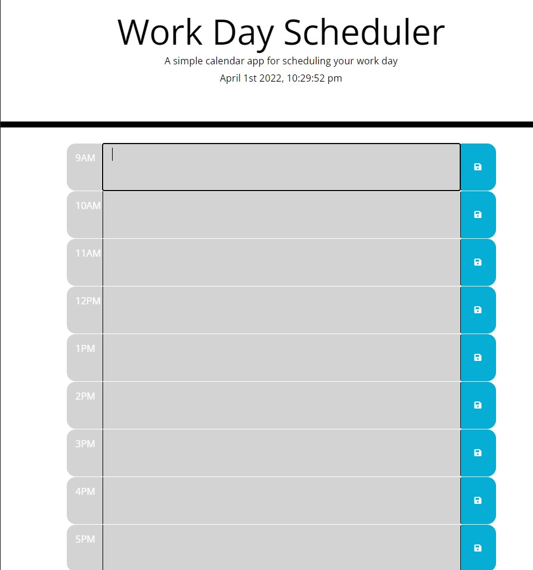

# DayScheduler
The user is given a work day scheduler page with date and time. The user should see three color coded sections underneath this with the time blocks from 9am to 5pm. If the color is grey, its the past, red for present, and green for future. The user can enter in the middle section any information they want and save it to local storage. If the page is refreshed, the information will be pulled from local storage and displayed.

## Website
https://mpz45.github.io/DayScheduler/

## Image
